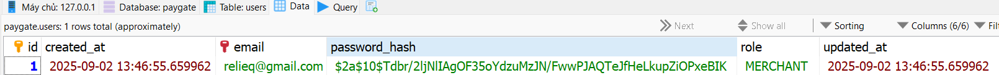

Tôi làm repo sau với mục đích học về Spring Boot là chính.

Spring Boot là một framework mạnh mẽ giúp xây dựng các ứng dụng Java một cách nhanh chóng và dễ dàng hơn. 
Nó cung cấp một loạt các tính năng và công cụ để phát triển ứng dụng web, dịch vụ RESTful, và nhiều loại ứng dụng khác.

---

Trong quá trình học tập, Paygate là dự án "xương sống" tôi làm xuyên suốt để áp dụng các kiến thức về Spring Boot.
Trong README này, tôi sẽ trình bày nội dung theo từng tuần mà tôi học được.

**Dự án xương sống: PayGate Lite**

API mô phỏng một gateway thẻ cơ bản (học thuật, không dùng sản xuất).
* Luồng chính: register -> login -> process payment -> refund/ void.
* Thực hành bảo mật: OAuth2 Resource Server (JWT).
* Tính đúng đắn: tiền tệ chính xác, chống lặp giao dịch, audit trail, quy trình hoàn tác.
* Monitering: Grafana và Prometheus.
* DB: MySQL, JPA/Hibernate.
* Unit test và Stress test.

---

# Bài 1: “Hello Spring Boot” 
(Bài này ban đầu làm bên project khác, giờ gom vào đây cho đủ bộ)

Bài này tôi làm quen với Spring Boot, tạo project, cấu hình Maven, chạy ứng dụng và tạo endpoint đơn giản.

Ở bài này, tôi tìm hiểu được một số điểm như dưới đây.

---
1) Các loại *Mapping trong Spring MVC

Gốc là @RequestMapping, các annotation còn lại là “rút gọn” theo HTTP method:

- @GetMapping("/tasks")
   
   Lấy dữ liệu. Safe và idempotent (gọi nhiều lần không đổi trạng thái).
Dùng cho list/detail, tìm kiếm, health-check.

- @PostMapping("/tasks")

   Tạo mới. Không idempotent (mỗi lần gọi có thể tạo 1 bản ghi). Trả 201 khi tạo thành công.

- @PutMapping("/tasks/{id}")

   Cập nhật toàn bộ tài nguyên. Idempotent (gọi lại kết quả như nhau).

- @PatchMapping("/tasks/{id}")

   Cập nhật một phần. Không đảm bảo idempotent (tuỳ bạn thiết kế).

- @DeleteMapping("/tasks/{id}")

   Xoá. Idempotent (xoá lần 2 vẫn coi như thành công/204).

**Lưu ý hữu ích**

- Đặt @RequestMapping("/api/v1/tasks") ở class để có base path, rồi dùng @GetMapping, @PostMapping ở method.
- Ràng buộc thêm: consumes (kiểu body vào), produces (kiểu trả ra), params, headers, regex path:

```java
@GetMapping(value="/{id:\\d+}", produces="application/json")
public TaskDto get(@PathVariable long id) { ... }
```

2) @RequestParam, @PathVariable, @RequestBody

- @PathVariable lấy một phần của URL path (thường là định danh tài nguyên):

```bash
GET /tasks/42
```

```java
@GetMapping("/tasks/{id}")
TaskDto get(@PathVariable long id) { ... }
```


- @RequestParam lấy query string (lọc/sort/trang), có thể tuỳ chọn, có mặc định:

```bash
GET /tasks?status=pending&page=2&tags=a&tags=b
```

```java
@GetMapping("/tasks")
List<TaskDto> list(
   @RequestParam(required=false, defaultValue="pending") String status,
   @RequestParam(defaultValue="0") int page,
   @RequestParam List<String> tags // nhận nhiều giá trị
) { ... }
```

- @RequestBody — map HTTP request body vào một object Java

Nói với Spring: “Body của request (thường là JSON) → chuyển (deserialize) thành đối tượng này cho tôi.”

Spring dùng HttpMessageConverter (mặc định là Jackson) để chuyển JSON ⇆ object.

Ví dụ (JSON → record):

public record CreateTaskRequest(String title) {}

```java
@PostMapping(path="/tasks", consumes="application/json")
public TaskDto create(@RequestBody CreateTaskRequest body) {
    // body.title() lấy ra dữ liệu do client gửi
    return service.create(body);
}
```

**Điều kiện để @RequestBody hoạt động mượt**
* Client phải gửi header Content-Type: application/json.
Sai header ⇒ 415 Unsupported Media Type.
* JSON phải hợp lệ và khớp trường/kiểu dữ liệu ⇒ sai ⇒ 400 Bad Request.

---
@ResponseStatus — đặt HTTP status code trả về

Dùng trên method (controller handler) hoặc trên class Exception để nói “khi trả về, dùng mã này”.

Nếu không đặt, Spring dùng mặc định:

* GET thành công → 200 OK
* POST thành công → cũng thường là 200 OK (hoặc 201 nếu bạn tự đặt)
* DELETE thành công → tùy bạn (hay dùng 204 No Content)

Tại sao cần? Vì REST coi status code là một phần hợp đồng API.

```java
@PostMapping("/tasks")
@ResponseStatus(HttpStatus.CREATED) // => 201 Created
public TaskDto create(@RequestBody CreateTaskRequest body) {
    return service.create(body);
}
```

---
Theo tìm hiểu, thì so với Spring Framework, Spring Boot có một số điểm khác biệt quan trọng:
1. Cấu hình tự động (Auto Configuration): 
   - Spring Boot cung cấp tính năng cấu hình tự động, giúp giảm thiểu việc cấu hình thủ công. Nó tự động cấu hình các thành phần dựa trên các thư viện có trong classpath
     (_classpath là đường dẫn (path) mà Java Virtual Machine (JVM) sử dụng để tìm kiếm và tải các lớp (classes), thư viện (libraries, thường dưới dạng file JAR), và tài nguyên khác (như file properties, XML) khi chạy ứng dụng)._

   - Ví dụ: Nếu bạn thêm thư viện Spring MVC vào dự án, Spring Boot sẽ tự động cấu hình các thành phần cần thiết để chạy ứng dụng web.
2. Khởi tạo nhanh (Starter Dependencies):
   - Spring Boot cung cấp các "starter" dependencies, giúp bạn dễ dàng thêm các tính năng vào dự án chỉ bằng cách thêm một dependency duy nhất.
   - Ví dụ: spring-boot-starter-web để xây dựng ứng dụng web, spring-boot-starter-data-jpa để làm việc với JPA.
3. Quản lý cấu hình:
   - Spring Boot cung cấp một cách dễ dàng để quản lý cấu hình thông qua các tệp như application.properties hoặc application.yml.
4. Hỗ trợ xây dựng ứng dụng độc lập:
   - Spring Boot cho phép bạn xây dựng các ứng dụng độc lập có thể chạy mà không cần máy chủ ứng dụng bên ngoài (như Tomcat, Jetty) vì server được nhúng ngay trong file JAR build ra.


## Bean
**“Bean” là gì?**

Bean = một đối tượng (object) do Spring tạo ra, giữ hộ, và đưa cho bạn dùng.
Nó “sống” trong cái hộp gọi là ApplicationContext (container). Nhờ vậy:

* Bạn không tự new khắp nơi.
* Spring tiêm (inject) các phụ thuộc cho bạn.
* Vòng đời (tạo → dùng → huỷ) được Spring quản lý.

**Tại sao cần bean?**

* Code rời rạc (loose coupling), dễ test/thay thế.
* Không phải tự xoay xoáy chuyện khởi tạo, cấu hình, thứ tự phụ thuộc.
* Có thể cấu hình phạm vi sống (thường là singleton: một cái cho cả app).

**Làm sao “tạo” một bean?**

Có 2 con đường phổ biến:

1) Gắn annotation “stereotype” lên class → Spring quét và biến nó thành bean

```java
import org.springframework.stereotype.Service;

@Service              // -> bean tên mặc định: userService
public class UserService {
    public String hello() { return "hi"; }
}
```
2) Khai báo trong lớp cấu hình bằng @Bean
```java
import org.springframework.context.annotation.*;

@Configuration
public class AppConfig {

  @Bean               // -> bean tên: objectMapper
  public ObjectMapper objectMapper() {
    return new ObjectMapper();
  }
}
```

**Dùng bean như thế nào?**

Tiêm qua constructor (chuẩn, dễ test nhất):

```java
@RestController
public class HelloController {
    private final UserService userService;
    
    public HelloController(UserService userService) {
        this.userService = userService;
    }
    
    @GetMapping("/hello")
   public String hello() {
        return userService.hello();
    }
}
```

**Bean khác gì object Java bình thường?**

* Object bình thường: bạn new khi cần → bạn tự chịu mọi phụ thuộc.
* Bean: Spring tạo/giữ/tiêm cho bạn → bạn chỉ khai báo “tôi cần gì”, còn việc dựng đối tượng Spring lo.

**Mini bài tập (5’)**
- Tạo @Service tên TimeService (TimeService.java) có method now() trả System.currentTimeMillis().
- Tiêm TimeService vào HealthController và trả JSON { "status":"ok", "timeMs": <now> }.

## Auto Configuration
Spring Boot có 1 cái đặc trưng gọi là Auto Configuration, nó sẽ tự động cấu hình các thành phần dựa trên các thư viện có trong classpath.
Quá trình này giúp giảm thiểu cấu hình thủ công và làm cho việc phát triển ứng dụng nhanh hơn. Nó diễn ra như sau:

Khi bạn chạy app (class @SpringBootApplication), có 3 chuyện quan trọng xảy ra:
1. @SpringBootApplication = @Configuration + @EnableAutoConfiguration + @ComponentScan
- EnableAutoConfiguration: nạp các lớp auto-configuration có sẵn của Boot (Web, Jackson, JPA, Security, ...) được liệt kê ở
META-INF/spring/org.springframework.boot.autoconfigure.AutoConfiguration.imports (từ Spring Boot 3.x).

Ví dụ: WebMvcAutoConfiguration, JacksonAutoConfiguration, DataSourceAutoConfiguration, …

- ComponentScan: quét các lớp trong package hiện tại và các package con để tìm các bean 
được đánh dấu với @Component, @Service, @Repository, @Controller, ...
- Configuration: đánh dấu lớp hiện tại là một lớp cấu hình, có thể định nghĩa các bean.

---
Giới thiệu qua về các công nghệ dùng trong PayGate Lite:
1. Spring Web (Spring MVC): xây dựng API RESTful.
2. Spring Data JPA + Hibernate: tương tác với cơ sở dữ liệu (MySQL).
3. Spring Security: bảo mật API với OAuth2 Resource Server (JWT).
4. Spring Boot Actuator: giám sát và quản lý ứng dụng.
5. Prometheus & Grafana: giám sát hiệu suất và trực quan hoá dữ liệu.
6. Maven: quản lý dự án và phụ thuộc.

## Một số khái niệm quan trọng
* REST (Representational State Transfer): kiến trúc xây dựng API qua HTTP.
    - Hành động (action): động từ (GET, POST, PUT, DELETE).
    - Stateless: server không lưu trạng thái client (mỗi request có đầy đủ thông tin).

      Xác thực stateless (không trạng thái) là phương pháp xác minh danh tính người dùng mà máy chủ không lưu trữ bất kỳ thông
      tin phiên (trạng thái) nào của người dùng giữa các yêu cầu. Thay vào đó, thông tin cần thiết, bao gồm cả thông tin xác
      thực, được đóng gói và lưu trữ ở phía máy khách dưới dạng mã thông báo (token), ví dụ như JSON Web Tokens (JWT). Khi máy
      khách gửi yêu cầu, nó đính kèm mã thông báo này, và máy chủ chỉ cần xác minh chữ ký mật mã của mã thông báo để chứng minh tính hợp lệ.

* JWT (JSON Web Token): chuỗi đã ký (HS256/RS256) chứa claims (sub, roles, exp…), cho phép xác thực stateless.

    Luồng: register → login (trả token) → client gửi Authorization: Bearer <token> → filter verify → set user vào SecurityContext.

    Lưu ý: hạn dùng ngắn (exp), secret/keys an toàn, câu chuyện revoke/refresh (demo có thể bỏ qua revoke).

* Hibernate JPA: ORM ánh xạ class ↔ bảng (annotation @Entity, @Id, @OneToMany…), dùng JpaRepository để CRUD, truy vấn, transaction. Tránh double cho tiền; dùng long amountMinor.

* Prometheus: hệ time-series “kéo” (pull) số đo từ /actuator/prometheus.

    Metric kiểu Counter (đếm), Gauge (trạng thái), Timer/Histogram (độ trễ).

* Grafana: vẽ dashboard từ dữ liệu Prometheus (biểu đồ QPS, p95 latency, lỗi, CPU/heap). Bạn chỉ cấu hình data source Prometheus và import dashboard mẫu Spring Boot.

* Unit test: kiểm thử một đơn vị nhỏ (method/service/controller) bằng JUnit5 + Mockito/MockMvc.

    Ví dụ: test JwtService.issue/verify, test AuthController.login trả 200/401.

* Stress test: bắn tải để đo thông lượng/độ trễ và tìm bottleneck.

    Dùng k6 (script JS gọn) hoặc JMeter. Kịch bản: đăng nhập lấy JWT → bắn POST /v1/payments 100 RPS → 10% refund → đo p95, error<1%.

---
# Bài 2: MySQL + JPA (Spring boot JPA) + Register (chưa triển khai JWT)

**Mục tiêu**
- Kết nối MySQL.
- Nắm 3 mảnh ghép JPA: Entity, Repository, Service.
- Làm endpoint POST /v1/auth/register: lưu user (hash password bằng BCrypt).

**Khái niệm**
- @Entity: ánh xạ class ↔ bảng.
- Repository: interface extends JpaRepository<T, ID>.
- Service: class @Service, chứa logic nghiệp vụ (check trùng mail, hassh pass).
- BCrypt: hàm băm mật khẩu an toàn, luôn lưu hash, không lưu plaintext (mã gốc).

**Bước làm**
1) Thêm dependency cần thiết:

    spring-boot-starter-web, spring-boot-starter-validation, spring-boot-starter-data-jpa, mysql-connector-j,
spring-boot-starter-security (để dùng BCryptPasswordEncoder, chưa bật chặn), spring boot-starter-test (test).

2) Cấu hình kết nối MySQL trong application.properties:
```properties
spring.datasource.url=jdbc:mysql://localhost:3306/paygate?useSSL=false&allowPublicKeyRetrieval=true&serverTimezone=UTC
spring.datasource.username=YOUR_USER
spring.datasource.password=YOUR_PASS
spring.jpa.hibernate.ddl-auto=update
spring.jpa.open-in-view=false
```
`Dev dùng ddl-auto=update cho nhanh. Sau sẽ chuyển sang Flyway + validate.`

---
Bây giờ tôi sẽ đề cập một chút đến cấu trúc package trong dự án này để thuận tiện về sau.

```
com.example.paygate
├─ controller
├─ service
├─ repository
├─ entity
├─ dto
├─ security
└─ config
```

---
3) Tạo Entity User
- Field: id (Long, @Id, @GeneratedValue), email (String, unique), passwordHash (String), roles ("MERCHANT" hoặc "ADMIN,MERCHANT"), 
createdAt (Instant).

```java
@Entity @Table(name="users")
public class User {
    @Id @GeneratedValue(strategy = GenerationType.IDENTITY)
    private Long id;

    @Column(nullable = false, unique = true)
    private String email;

    @Column(nullable = false)
    private String passwordHash;

    @Column(nullable = false)
    private String role; // "MERCHANT" or "ADMIN, MERCHANT".

    @Column(nullable = false)
    private Instant createdAt = Instant.now();

    // Constructor, getters, setters (hoặc dùng Lombok @Data)
}
```

4) Tạo Repository

Khi bạn viết:
```java
public interface UserRepository extends JpaRepository<User, Long> {
    Optional<User> findByEmail(String email);
}
```

Spring Data JPA sẽ tự sinh implementation (runtime proxy) và đăng ký thành bean.

Bạn không phải tự tạo class triển khai. Muốn dùng chỉ việc thêm @Autowired hoặc tiêm qua constructor.

Điều kiện: package repository phải nằm dưới gốc com.example.paygate để Boot tự bật @EnableJpaRepositories.

Khi nào mới cần code implementation?

Khi bạn muốn query đặc thù khó: dùng @Query("..."), hoặc tạo cặp UserRepositoryCustom + UserRepositoryImpl. Cái này để sau.

5) Tạo PasswordEncoder (BCrypt)

Tạo lớp @Configuration là SecurityBeans:
```java
@Configuration(proxyBeanMethods = false)
public class SecurityBeans {
    @Bean
    PasswordEncoder passwordEncoder() {
        return new BCryptPasswordEncoder();
        // Tham số strength của encoder trên (work factor - quyết định số lần hash 2^strength) mặc định là 10, có thể tăng 12 cho production (test chậm hơn).
    }
}
```

6) DTO + Controller cho Register

**DTO** (tôi đặt trong package dto.auth):
* Request:
```java
public record AuthRequest(
        @Email @NotBlank String email,
        @NotBlank String password
) {}
```

* Response:
```java
public record AuthResponse(Long userId) {}
```

**Controller**
```java
@RestController
@RequestMapping("/v1/auth")
public class AuthController {
    private final AuthService authService;

    public AuthController(AuthService authService) {
        this.authService = authService;
    }

    @PostMapping("/register")
    @ResponseStatus(HttpStatus.CREATED)
    public AuthReponse register(@Valid @RequestBody AuthRequest req) {
        return authService.register(req);
    }
}
```

_Vì sao nó (encoder) tự tiêm được?_

Bạn có:

* SecurityBeans là @Configuration với một @Bean PasswordEncoder passwordEncoder().
* AuthService là @Service có đúng 1 constructor nhận PasswordEncoder.

Khi khởi tạo AuthService, Spring nhìn vào constructor duy nhất và cố gắng “ghép phụ thuộc theo kiểu (by type)”.

Trong ApplicationContext đang có đúng 1 bean kiểu PasswordEncoder ⇒ Spring tiêm thẳng vào, không cần @Autowired.

Quy tắc ngắn gọn: Có một constructor duy nhất ⇒ @Autowired là tùy chọn.

Nếu có nhiều constructor, bạn mới cần đánh dấu constructor nào để tiêm bằng @Autowired.

**Service**
```java
@Service
@Transactional
public class AuthService {
    private final UserRepository users;
    private final PasswordEncoder encoder; // <-- bean từ SecurityBeans

    public AuthService(UserRepository users, PasswordEncoder encoder) {
        this.users = users;
        this.encoder = encoder;
    }

    public AuthReponse register(AuthRequest req) {
        // Check mail trùng lặp
        if (users.findByEmail(req.email()).isPresent()) {
            throw new ResponseStatusException(HttpStatus.CONFLICT, "Email already exists");
        }

        // Tạo user mới
        User user = new User(
                req.email(),
                encoder.encode(req.password()), // Mã hóa mật khẩu trước khi lưu
                "MERCHANT" // Vai trò mặc định
        );

        users.save(user);

        return new AuthReponse(user.getId());
    }
}
```

## @Transactional là gì?

Nó bao method (hoặc cả class) trong một giao dịch DB:
* Vào method ⇒ bắt đầu transaction
* Ra method ⇒ commit nếu không lỗi, rollback nếu có lỗi (mặc định rollback cho RuntimeException/Error)

Với JPA/Hibernate, trong cùng transaction bạn có một persistence context, các thao tác save()/flush()… được commit cùng nhau.

**Lưu ý quan trọng (hay bị “dính bẫy”)**

* @Transactional hoạt động qua proxy của Spring:

    → Chỉ hiệu lực khi gọi từ bên ngoài bean vào public method đã annotate.
    
    → Self-invocation (một method trong cùng class gọi method khác có @Transactional) sẽ không kích hoạt transaction mới.
    
    Cách né: để controller gọi thẳng method cần @Transactional, hoặc tách logic sang service khác nếu cần ranh giới giao dịch riêng.

* Repository của Spring Data đã có @Transactional mặc định cho nhiều method; bạn vẫn nên đặt ở service để bao gộp nhiều thao tác thành một transaction.

## Test
* Request 1:
```http request
POST http://localhost:8080/v1/auth/register
Content-Type: application/json

{
"email": "relieq@gmail.com",
"password": "hahaha123"
}
```

* Response chạy lần 1:
```json
{
  "userId": 1
}
```

* Database change:


* Response chạy lần 2 (trùng email):
```json
{
  "timestamp": "2025-09-02T14:00:42.323+00:00",
  "status": 409,
  "error": "Conflict",
  "path": "/v1/auth/register"
}
```

* Mọi người có thể thử chạy email sai định dạng, password trống, nó sẽ trả 400 Bad Request vì vi phạm @Email, @NotBlank.

---
# Bài 3: Login + phát JWT (HS256)
**Mục tiêu**
* Tự tìm hiểu về JWT (JSON Web Token) - "vé đã ký".
* Làm endpoint POST /v1/auth/login trả token.

**Khái niệm**
* HS256: ký và xác minh bằng cùng 1 secret (để demo nhanh).
* Claims tối thiểu: sub (subject - userId), email, roles, iat (issued at - thời điểm token được phát hành), exp (hạn dùng), 
iss (issuer - ai phát hành).
* Bearer token: sau khi được phát JWT, client gửi trong header Authorization: Bearer <token>.

## JWT
JSON Web Token (JWT) là một tiêu chuẩn mở (RFC 7519) dùng để truyền thông tin an toàn giữa các bên dưới dạng một đối tượng JSON.
JWT thường được sử dụng trong các hệ thống xác thực và ủy quyền, đặc biệt là trong các ứng dụng web và dịch vụ RESTful.
Một JWT bao gồm ba phần chính, được phân tách bằng dấu chấm (.):
1. Header (Tiêu đề):
   - Chứa thông tin về loại token và thuật toán ký.
   - Ví dụ:
   ```json
   {
     "alg": "HS256",
     "typ": "JWT"
   }
   ```
2. Payload (Nội dung):
    - Chứa các thông tin (claims) mà bạn muốn truyền tải.
    - Có ba loại claims:
      - Registered claims: các trường chuẩn như iss (issuer), sub (subject), aud (audience), exp (expiration time), nbf (not before), iat (issued at), jti (JWT ID).
      - Public claims: các trường do người dùng định nghĩa, nhưng nên tránh trùng lặp tên.
      - Private claims: các trường do hai bên thỏa thuận sử dụng.
      - Ví dụ:
   ```json
   {
     "sub": "1234567890",
     "name": "John Doe",
     "admin": true,
     "iat": 1516239022
   }
   ```
   3. Signature (Chữ ký):
      - Được tạo bằng cách lấy header và payload, mã hóa chúng bằng Base64Url, sau đó ký bằng thuật toán đã chỉ định trong header (ví dụ: HMAC SHA256) cùng với một secret key.
      - Ví dụ:
      ```HMACSHA256(
        base64UrlEncode(header) + "." +
        base64UrlEncode(payload),
        secret)
      ```
**Lưu ý quan trọng**
* JWT không mã hoá (không bí mật), chỉ ký để đảm bảo tính toàn vẹn, không thể sửa đổi mà không biết secret.
* Không dùng JWT để lưu thông tin nhạy cảm.
* Chọn thuật toán ký phù hợp (HS256, RS256).
* Quản lý vòng đời token (hạn dùng, làm mới, thu hồi).

**jwt.serialize() là gì?**
* Trước serialize ("dạng đầu"): JWT là một object nội bộ (trong Nimbus là SignedJWT), với header/payload là JSON objects, signature là bytes. Các phần này chưa encode, dễ đọc và chỉnh sửa trong code.
* Sau serialize ("dạng sau"): Các phần được encode Base64URL (một biến thể Base64 an toàn cho URL, không có = padding), rồi nối bằng dấu chấm (.). Kết quả là string compact, dễ truyền (qua header HTTP, URL), nhưng không đọc được trực tiếp (phải decode để xem nội dung).
* Quá trình serialize (trong Nimbus jwt.serialize()):

    * Encode header JSON → Base64URL.
    * Encode payload (claims) JSON → Base64URL.
    * Encode signature bytes → Base64URL.
    * Nối: header_base64 + "." + payload_base64 + "." + signature_base64.

---
**Bước làm**
1) Thêm thư viện JWT: Dùng Nimbus JOSE JWT (gọn, phổ biến).
2) Cấu hình secret & TTL (Time To Live của token) trong application.properties:
```properties
app.jwt.secret=${JWT_SECRET:change-me-32chars-min}
app.jwt.issuer=paygate-lite
app.jwt.ttl=60
```
Các bạn có thể vào trang sau để tạo secret an toàn: https://jwtsecretkeygenerator.com/
3) POST /v1/auth/login
* Request DTO: dùng AuthRequest (email, password) của bài trước.
* Response DTO:
```java
public record TokenResponse(String accessToken, long expiresAtEpochSec) {}
```

4) AuthController thêm endpoint /login:
```java
@PostMapping("/login")
@ResponseStatus(HttpStatus.OK)
public TokenResponse login(@Valid @RequestBody AuthRequest req) {
    return authService.login(req);
}
```

4) Thêm 2 method login và issueToken trong AuthService:
```java
@Transactional(readOnly = true)
public TokenResponse login(AuthRequest req) {
    User user = users.findByEmail(req.email()).orElseThrow(() ->
            new ResponseStatusException(HttpStatus.UNAUTHORIZED, "Invalid email or password")
    );

    // Kiểm tra mật khẩu
    if (!encoder.matches(req.password(), user.getPasswordHash())) {
        throw new ResponseStatusException(HttpStatus.UNAUTHORIZED, "Invalid email or password");
    }

    var roles = Arrays.asList(user.getRole().split(","));
    var token = issueToken(user.getId().toString(), user.getEmail(), roles);
    var exp = jwt.expiresAtFromNow().getEpochSecond();

    return new TokenResponse(token, exp);
}

private String issueToken(String userId, String email, java.util.List<String> roles) {
    try {
        return jwt.issue(userId, email, roles);
    } catch (Exception e) {
        throw new ResponseStatusException(HttpStatus.INTERNAL_SERVER_ERROR, "Cannot issue token");
    }
}
```

5) Tạo JwtTokenProvider:
```java
@Component
public class JwtTokenProvider {
    private final byte[] key;
    private final String issuer;
    private final Duration ttl;

    public JwtTokenProvider(
            @Value("${app.jwt.secret}") String secret,
            @Value("${app.jwt.issuer}") String issuer,
            @Value("${app.jwt.ttl-minutes}") long ttlMinutes
    ) {
        this.key = secret.getBytes(StandardCharsets.UTF_8);
        this.issuer = issuer;
        this.ttl = Duration.ofMinutes(ttlMinutes);
    }

    public String issue(String userId, String email, List<String> roles) throws JOSEException {
        Instant now = Instant.now();
        Instant exp = now.plus(ttl);

        // Payload: claims
        JWTClaimsSet claims = new JWTClaimsSet.Builder()
                .issuer(issuer)
                .issueTime(Date.from(now))
                .expirationTime(Date.from(exp))
                .subject(userId)
                .claim("email", email)
                .claim("roles", roles)
                .build();

        SignedJWT jwt = new SignedJWT(new JWSHeader(JWSAlgorithm.HS256), claims); // Chưa tạo sign
        jwt.sign(new MACSigner(key)); // Sign the JWT with the secret key but not encrypt
        return jwt.serialize(); // serialize to compact form (encrypt, ready to be used as a token
    }

    public Instant expiresAtFromNow() {
        return Instant.now().plus(ttl);
    }
}
```

## Test
* Request:
```http request
POST http://localhost:8080/v1/auth/login
Content-Type: application/json

{
  "email": "relieq@gmail.com",
  "password": "hahaha123"
}
```
* Response:
```json
{
  "accessToken": "<HEADER>.<PAYLOAD>.<SIGNATURE>",
  "expiresAtEpochSec": 1756959603
}
```
Các bạn có thể decode token trên https://jwt.io/ để xem nội dung bên trong.


## Chú ý:
1) “base64” là gì? Có dùng không?
   * Base64 chỉ là cách mã hoá chữ/binary sang ký tự để truyền cho gọn, không phải mã hoá an toàn.
   
   * Trong code của mình, bạn đang làm:
    `new MACSigner(secret.getBytes(StandardCharsets.UTF_8))`

        ⇒ Nghĩa là dùng chính chuỗi secret “thô” (UTF-8), không decode Base64.
    
        ➜ Trên jwt.io cũng để UTF-8, đừng bật chế độ Base64.

2) “64 bits” vs “32 bytes” (dễ nhầm)
    * HS256 yêu cầu tối thiểu 256-bit = 32 byte ~ ≥32 ký tự (nếu dùng ASCII/UTF-8 đơn giản).
    * “64 bits” = 8 byte → quá ngắn.
    * Nếu bạn bảo “64 ký tự” thì OK (≈ 64 byte).
    * Token của bạn đã phát được → secret hiện tại đủ dài; vấn đề là bạn đang nhập không đúng secret khi verify.
---

